# DataOps Automation with Bash


---

## 🇧🇷 Automação DataOps com Bash

Este repositório é dedicado a demonstrar **soluções práticas e eficientes para automação de tarefas DataOps utilizando scripts Bash**. O foco é em como orquestrar, monitorar e gerenciar pipelines de dados, tarefas de ETL (Extract, Transform, Load), e rotinas de manutenção de sistemas de dados, aproveitando a robustez e a flexibilidade do ambiente de linha de comando Linux. É ideal para **engenheiros de dados, administradores de sistemas e profissionais de DevOps** que buscam otimizar e automatizar seus fluxos de trabalho de dados.

### 🎯 Objetivo

O principal objetivo deste projeto é **fornecer um conjunto de scripts Bash bem documentados e exemplos de casos de uso** para automatizar operações comuns em DataOps. Serão abordados tópicos como agendamento de tarefas (cron), manipulação de arquivos e diretórios, interação com bancos de dados (via CLI), monitoramento de processos e tratamento de erros, tudo com foco em **escalabilidade, confiabilidade e facilidade de manutenção**, com ênfase em **validação de dados robusta, transformações complexas e um sistema de notificação de status**.

### ✨ Highlights

- **Validação de Dados Robusta**: Implementação de funções de validação que verificam a integridade e o formato dos dados em diferentes estágios da pipeline, garantindo a qualidade dos dados antes do processamento.
- **Análise Avançada de Logs**: Módulo `log_analyzer.sh` que demonstra análise profissional de logs com detecção de anomalias, análise de padrões temporais, estatísticas de tempos de resposta e geração de relatórios automatizados.
- **Transformações de Dados Complexas**: Exemplos de como realizar transformações de dados sofisticadas usando ferramentas de linha de comando como `awk`, `sed`, `grep` e `datamash`, permitindo agregação, enriquecimento e reestruturação de dados.
- **Sistema de Notificação de Status**: Integração de mecanismos de notificação (e.g., e-mail, logs detalhados) para alertar sobre o sucesso, falha ou anomalias na execução da pipeline, facilitando o monitoramento proativo.
- **Automação de Pipelines**: Scripts para orquestrar o fluxo de dados, desde a ingestão até o processamento e carregamento, com tratamento de erros e logging detalhado.
- **Gerenciamento de ETL**: Soluções para automatizar tarefas de extração, transformação e carregamento de dados de diversas fontes.
- **Monitoramento e Alerta**: Scripts para monitorar a saúde dos sistemas de dados, o status das tarefas e enviar alertas em caso de falhas.
- **Código Profissional**: Scripts bem estruturados, com comentários claros, seguindo as melhores práticas de shell scripting para garantir legibilidade e manutenibilidade.
- **Documentação Completa**: Cada script é acompanhado de documentação detalhada, explicando seu propósito, parâmetros, lógica e exemplos de uso.
- **Testes Incluídos**: Suite completa de testes automatizados para garantir qualidade e confiabilidade.
- **Análise Estática**: Uso de shellcheck para garantir boas práticas e código livre de erros comuns.

### 🚀 Benefícios do DataOps com Bash em Ação

A automação DataOps com Bash oferece uma abordagem leve e poderosa para gerenciar pipelines de dados. Este projeto ilustra como esses benefícios são explorados:

1.  **Eficiência e Velocidade**: Scripts Bash são executados diretamente no sistema operacional, proporcionando alta performance para tarefas de manipulação de arquivos e processamento de texto, como visto nas transformações com `awk` e `datamash`.

2.  **Flexibilidade e Controle**: A linha de comando oferece controle granular sobre cada etapa da pipeline, permitindo personalização e adaptação a requisitos específicos, desde a validação de dados até a notificação de status.

3.  **Baixo Custo e Baixa Complexidade**: Utiliza ferramentas nativas do sistema operacional, eliminando a necessidade de infraestrutura complexa ou licenças de software caras, tornando-o acessível para diversos ambientes.

4.  **Integração com Ferramentas Existentes**: Facilmente integrável com outras ferramentas e sistemas via CLI, permitindo a construção de pipelines híbridas e a interação com bancos de dados, APIs e serviços de nuvem.

5.  **Robustez e Tratamento de Erros**: A inclusão de `set -o pipefail` e funções de `handle_error` demonstra como construir pipelines resilientes que podem lidar com falhas de forma controlada e notificar os responsáveis.

6.  **Simplicidade e Manutenibilidade**: Scripts bem escritos e documentados são fáceis de entender, depurar e manter, mesmo para equipes com conhecimento limitado em linguagens de programação mais complexas.

---

## 🇬🇧 DataOps Automation with Bash

This repository is dedicated to demonstrating **practical and efficient solutions for DataOps task automation using Bash scripts**. The focus is on how to orchestrate, monitor, and manage data pipelines, ETL (Extract, Transform, Load) tasks, and data system maintenance routines, leveraging the robustness and flexibility of the Linux command-line environment. It is ideal for **data engineers, system administrators, and DevOps professionals** looking to optimize and automate their data workflows.

### 🎯 Objective

The main objective of this project is to **provide a set of well-documented Bash scripts and use case examples** to automate common operations in DataOps. Topics covered include task scheduling (cron), file and directory manipulation, database interaction (via CLI), process monitoring, and error handling, all with a focus on **scalability, reliability, and ease of maintenance**, with an emphasis on **robust data validation, complex transformations, and a status notification system**.

### ✨ Highlights

- **Robust Data Validation**: Implementation of validation functions that check data integrity and format at different pipeline stages, ensuring data quality before processing.
- **Complex Data Transformations**: Examples of how to perform sophisticated data transformations using command-line tools like `awk`, `sed`, `grep`, and `datamash`, allowing for data aggregation, enrichment, and restructuring.
- **Status Notification System**: Integration of notification mechanisms (e.g., email, detailed logs) to alert about pipeline success, failure, or anomalies, facilitating proactive monitoring.
- **Pipeline Automation**: Scripts for orchestrating data flow, from ingestion to processing and loading, with error handling and detailed logging.
- **ETL Management**: Solutions to automate extraction, transformation, and loading tasks from various data sources.
- **Monitoring and Alerting**: Scripts to monitor the health of data systems, task status, and send alerts in case of failures.
- **Professional Code**: Well-structured scripts, with clear comments, following shell scripting best practices to ensure readability and maintainability.
- **Complete Documentation**: Each script is accompanied by detailed documentation, explaining its purpose, parameters, logic, and usage examples.
- **Tests Included**: Examples of how to test Bash scripts to ensure their correctness and robustness.

### 📊 Visualization



```mermaid
graph TB
    subgraph "Data Pipeline (data_pipeline.sh)"
        A1[Start Pipeline] --> B1[Load Configuration]
        B1 --> C1[Extract Data]
        C1 --> D1[Validate Data]
        D1 --> E1{Valid?}
        E1 -->|Yes| F1[Transform & Enrich]
        E1 -->|No| G1[Move to Error Dir]
        F1 --> H1[Aggregate by Category & Date]
        H1 --> I1[Load to Processed Dir]
        I1 --> J1[Send Success Notification]
        G1 --> K1[Send Error Notification]
    end
    
    subgraph "Log Analyzer (log_analyzer.sh)"
        A2[Start Analysis] --> B2[Generate/Load Logs]
        B2 --> C2[Analyze Log Levels]
        C2 --> D2[Analyze Services]
        D2 --> E2[Analyze Response Times]
        E2 --> F2[Detect Time Patterns]
        F2 --> G2[Detect Anomalies]
        G2 --> H2[Generate Summary Report]
        H2 --> I2[Output to Analysis Dir]
    end
    
    style A1 fill:#90EE90,stroke:#333,stroke-width:2px
    style J1 fill:#90EE90,stroke:#333,stroke-width:2px
    style K1 fill:#FFB6C1,stroke:#333,stroke-width:2px
    style A2 fill:#87CEEB,stroke:#333,stroke-width:2px
    style I2 fill:#87CEEB,stroke:#333,stroke-width:2px
```

*Diagramas ilustrativos do fluxo de automação de operações de dados em Bash, destacando as etapas e interações. Para mais detalhes, veja [ARCHITECTURE.md](diagrams/ARCHITECTURE.md).*


---

## 📚 Scripts Disponíveis / Available Scripts

### 1. data_pipeline.sh - Pipeline Completa de Dados

Script de pipeline ETL completo com validação robusta, transformações complexas e tratamento de erros.

**Funcionalidades:**
- ✅ Extração de dados simulada (CSV)
- ✅ Validação robusta com múltiplos critérios
  - Validação de tipos de dados
  - Validação de formato de data
  - Validação de valores numéricos
  - Validação de campos obrigatórios
- ✅ Transformações de dados
  - Enriquecimento com lookup tables
  - Cálculos de métricas (total_amount)
  - Agregações por categoria e data
- ✅ Carregamento de dados processados
- ✅ Logging detalhado com timestamps
- ✅ Tratamento de erros com notificações
- ✅ Configuração externa via arquivo
- ✅ Separação de dados válidos e inválidos

**Uso:**
```bash
# Criar estrutura de diretórios
mkdir -p config data/{raw,staging,processed,lookup,errors} logs

# Criar arquivo de configuração
cat > config/pipeline_config.conf <<EOF
SOURCE_DIR=./data/raw
STAGING_DIR=./data/staging
PROCESSED_DIR=./data/processed
LOOKUP_DIR=./data/lookup
ERROR_DIR=./data/errors
LOG_FILE=./logs/data_pipeline.log
NOTIFICATION_ENABLED=false
EOF

# Executar pipeline
bash src/data_pipeline.sh
```

**Saída:**
- `data/staging/valid_data_*.csv` - Dados validados
- `data/errors/invalid_data_*.csv` - Dados com erros de validação
- `data/staging/transformed_*.csv` - Dados agregados por categoria e data
- `data/processed/final_*.csv` - Dados processados finais
- `logs/data_pipeline.log` - Log completo da execução

### 2. log_analyzer.sh - Analisador Avançado de Logs

Ferramenta profissional de análise de logs com estatísticas avançadas e detecção de anomalias.

**Funcionalidades:**
- 📊 Análise de níveis de log (INFO, WARNING, ERROR, DEBUG)
- 🔍 Análise de serviços/componentes
- ⏱️ Estatísticas de tempos de resposta
  - Média, mediana, mínimo, máximo
  - Desvio padrão
  - Distribuição por faixas de tempo
- 📈 Padrões temporais (distribuição por hora)
- 🚨 Detecção de anomalias baseada em thresholds
- 📝 Geração de relatórios completos
- 🎨 Output colorido para melhor visualização

**Uso:**
```bash
# Executar com logs de exemplo
bash src/log_analyzer.sh

# Executar com logs personalizados
export LOG_DIR=./meus_logs
export OUTPUT_DIR=./minhas_analises
bash src/log_analyzer.sh
```

**Saída:**
- `analysis/log_levels_summary.txt` - Resumo de níveis de log
- `analysis/services_summary.txt` - Resumo de serviços
- `analysis/response_times_summary.txt` - Estatísticas de tempos de resposta
- `analysis/time_patterns_summary.txt` - Padrões temporais
- `analysis/anomalies_report.txt` - Relatório de anomalias
- `analysis/summary_report.txt` - Relatório resumido geral

**Configuração:**
```bash
# Variáveis de ambiente opcionais
export LOG_DIR="./logs"                    # Diretório de logs
export OUTPUT_DIR="./analysis"             # Diretório de saída
export ALERT_THRESHOLD_ERROR=10            # Threshold de erros
export ALERT_THRESHOLD_WARNING=50          # Threshold de warnings
```

---

## 🛠️ Tecnologias Utilizadas / Technologies Used

| Categoria         | Tecnologia      | Descrição                                                                 |
| :---------------- | :-------------- | :------------------------------------------------------------------------ |
| **Linguagem**     | Bash            | Linguagem de script shell para automação de tarefas.                      |
| **Ferramentas CLI** | `awk`, `sed`, `grep` | Utilitários padrão do Unix para manipulação e processamento de texto.     |
| **Processamento Numérico** | `datamash`      | Ferramenta de linha de comando para operações numéricas e estatísticas.   |
| **Agendamento**   | `cron`          | (Conceitual) Para agendamento de execução de scripts em intervalos regulares. |
| **Logging**       | `tee`           | Para direcionar a saída para o console e para um arquivo de log.          |
| **Testes**        | `shellcheck`    | (Conceitual) Ferramenta estática para análise de scripts Bash.            |
| **Diagramação**   | Mermaid         | Para criação de diagramas de arquitetura e fluxo de dados no README.      |

---

## 📁 Repository Structure

```
bash-data-ops-automation/
├── src/                 # Scripts Bash para automação de tarefas DataOps
│   ├── data_pipeline.sh # Pipeline completa de dados com ETL
│   └── log_analyzer.sh  # Analisador avançado de logs
├── tests/               # Scripts de teste para validação dos scripts Bash
│   ├── run_all_tests.sh        # Runner principal de todos os testes
│   ├── test_data_pipeline.sh   # Testes do data_pipeline.sh
│   └── test_log_analyzer.sh    # Testes do log_analyzer.sh
├── diagrams/            # Diagramas de arquitetura e fluxo de dados
│   └── bash_data_ops_flow.png  # Diagrama do fluxo DataOps
├── images/              # Imagens e screenshots para documentação
├── analysis/            # Diretório de saída para análises de logs
├── logs/                # Diretório para armazenar logs de execução da pipeline
├── .gitignore           # Arquivos e diretórios ignorados pelo git
├── LICENSE              # Licença MIT do projeto
└── README.md            # Este arquivo
```

---

## 🚀 Getting Started

Para começar, clone o repositório e execute a demonstração completa:

### Quick Start

```bash
# Clonar o repositório
git clone https://github.com/galafis/bash-data-ops-automation.git
cd bash-data-ops-automation

# Instalar dependências (Ubuntu/Debian)
sudo apt-get update && sudo apt-get install -y datamash bc

# Executar demonstração completa
bash demo.sh
```

O script de demonstração executará:
1. ✅ Pipeline completa de dados (ETL) com validação e transformações
2. ✅ Análise avançada de logs com estatísticas e detecção de anomalias  
3. ✅ Suite completa de testes automatizados

### Executar Scripts Individualmente

### Executar Scripts Individualmente

**Pipeline de Dados:**
```bash
# Criar estrutura
mkdir -p config data/{raw,staging,processed,lookup,errors} logs

# Configurar
cat > config/pipeline_config.conf <<EOF
SOURCE_DIR=./data/raw
STAGING_DIR=./data/staging
PROCESSED_DIR=./data/processed
LOOKUP_DIR=./data/lookup
ERROR_DIR=./data/errors
LOG_FILE=./logs/data_pipeline.log
NOTIFICATION_ENABLED=false
EOF

# Executar
bash src/data_pipeline.sh
```

**Análise de Logs:**
```bash
# Executar (gera logs de exemplo automaticamente)
bash src/log_analyzer.sh

# Ver resultados
cat analysis/anomalies_report.txt
```

### Pré-requisitos

- Ambiente Linux/Unix com Bash.
- Utilitários padrão do sistema (`awk`, `sed`, `grep`, `cp`, `mkdir`, `wc`, `date`, `tee`).
- `datamash` (pode ser instalado via gerenciador de pacotes do sistema, e.g., `sudo apt-get install datamash` no Ubuntu).

### Instalação

```bash
git clone https://github.com/GabrielDemetriosLafis/bash-data-ops-automation.git
cd bash-data-ops-automation

# Instalar datamash se ainda não estiver instalado
sudo apt-get update && sudo apt-get install -y datamash

# Criar diretórios necessários
mkdir -p data/raw data/staging data/processed logs config

# Criar um arquivo de configuração de exemplo
echo "SOURCE_DIR=./data/raw" > config/pipeline_config.conf
echo "STAGING_DIR=./data/staging" >> config/pipeline_config.conf
echo "PROCESSED_DIR=./data/processed" >> config/pipeline_config.conf
echo "LOG_FILE=./logs/data_pipeline.log" >> config/pipeline_config.conf
```

### Exemplo de Uso Avançado (Bash)

O exemplo abaixo demonstra uma pipeline de dados completa em Bash, incluindo extração simulada, validação robusta, transformações complexas (agregação e enriquecimento), carregamento e um sistema de notificação de status. Este script ilustra como orquestrar tarefas DataOps de forma eficiente e resiliente.

```bash
#!/bin/bash

# Bash DataOps Automation - Data Pipeline Example
# Author: Gabriel Demetrios Lafis
# Year: 2025

# Este script demonstra uma pipeline de dados completa usando Bash.
# Ele simula a extração, transformação e carregamento de dados com tratamento de erros e logging.

set -o pipefail # Garante que a pipeline falhe se qualquer comando falhar

# --- Configurações ---
CONFIG_FILE="./config/pipeline_config.conf"

# Carregar configurações do arquivo
load_config() {
    if [ -f "$CONFIG_FILE" ]; then
        source "$CONFIG_FILE"
        log_message "Configurações carregadas de $CONFIG_FILE"
    else
        log_message "ERRO: Arquivo de configuração $CONFIG_FILE não encontrado. Abortando."
        exit 1
    fi
}

# Função para logar mensagens
log_message() {
    echo "[$(date +'%Y-%m-%d %H:%M:%S')] $1" | tee -a "$LOG_FILE"
}

# Função para tratamento de erros
handle_error() {
    local exit_code=$?
    local step_name="$1"
    log_message "ERRO: A pipeline falhou na etapa '$step_name' com o código de saída $exit_code."
    # Adicionar lógica de notificação aqui (e.g., enviar e-mail)
    # send_email_notification "Pipeline Falhou" "A pipeline de dados falhou na etapa $step_name. Verifique os logs em $LOG_FILE."
    exit $exit_code
}

# Função para validar dados (exemplo mais robusto)
validate_data() {
    local file="$1"
    log_message "Validando dados em $file..."
    if [ ! -f "$file" ]; then
        log_message "ERRO de Validação: Arquivo $file não encontrado."
        return 1
    fi
    if [ $(wc -l < "$file") -lt 2 ]; then # Pelo menos cabeçalho e uma linha de dados
        log_message "ERRO de Validação: Arquivo $file está vazio ou contém apenas cabeçalho."
        return 1
    fi
    # Exemplo de validação de formato (verificar se todas as linhas têm 3 colunas CSV)
    if ! awk -F',' 'NR > 1 && NF != 3 {print "Linha inválida: " $0; exit 1}' "$file"; then
        log_message "ERRO de Validação: Formato de CSV inválido em $file."
        return 1
    fi
    log_message "Validação de dados em $file concluída com sucesso."
    return 0
}

# --- Etapa 1: Extração (Simulada) ---
extract_data() {
    log_message "Iniciando etapa de Extração..."
    mkdir -p "$SOURCE_DIR" || handle_error "Criação de diretório SOURCE_DIR"
    # Simula a criação de um arquivo de dados brutos com mais colunas e um possível erro
    echo "transaction_id,customer_id,amount,product_category,timestamp" > "$SOURCE_DIR/raw_transactions.csv"
    echo "TRN001,CUST001,100.50,Electronics,$(date +%s)" >> "$SOURCE_DIR/raw_transactions.csv"
    echo "TRN002,CUST002,200.75,Books,$(date +%s)" >> "$SOURCE_DIR/raw_transactions.csv"
    echo "TRN003,CUST003,150.00,Electronics,$(date +%s)" >> "$SOURCE_DIR/raw_transactions.csv"
    echo "TRN004,CUST004,50.00,Clothing,$(date +%s)" >> "$SOURCE_DIR/raw_transactions.csv"
    echo "TRN005,CUST005,250.25,Electronics,$(date +%s)" >> "$SOURCE_DIR/raw_transactions.csv"
    echo "TRN006,CUST006,75.00,Books,$(date +%s)" >> "$SOURCE_DIR/raw_transactions.csv"
    echo "TRN007,CUST007,300.00,Electronics,$(date +%s)" >> "$SOURCE_DIR/raw_transactions.csv"
    echo "TRN008,CUST008,120.00,Clothing,$(date +%s)" >> "$SOURCE_DIR/raw_transactions.csv"
    echo "TRN009,CUST009,20.00,Books,$(date +%s)" >> "$SOURCE_DIR/raw_transactions.csv"
    echo "TRN010,CUST010,180.00,Electronics,$(date +%s)" >> "$SOURCE_DIR/raw_transactions.csv"
    # Adicionar uma linha com erro de formato para teste de validação
    echo "TRN011,CUST011,INVALID_AMOUNT,Books,$(date +%s)" >> "$SOURCE_DIR/raw_transactions.csv"

    log_message "Extração concluída. Arquivo gerado em $SOURCE_DIR/raw_transactions.csv"
}

# --- Etapa 2: Transformação (Simulada) ---
transform_data() {
    log_message "Iniciando etapa de Transformação..."
    mkdir -p "$STAGING_DIR" || handle_error "Criação de diretório STAGING_DIR"
    local raw_file="$SOURCE_DIR/raw_transactions.csv"
    local transformed_file="$STAGING_DIR/transformed_transactions.csv"
    local aggregated_file="$STAGING_DIR/aggregated_sales_by_category.csv"

    validate_data "$raw_file" || handle_error "Validação de dados brutos"

    # Transformação 1: Filtrar registros com valores numéricos inválidos e adicionar coluna de imposto
    log_message "Aplicando transformação: filtrando e adicionando imposto..."
    awk -F',' 'BEGIN {OFS=","} NR==1 {print $0, "tax_amount"} NR>1 {if ($3 ~ /^[0-9]+\.?[0-9]*$/) {print $0, $3 * 0.05} else {print $0, "0.00"}}' "$raw_file" | \
    grep -v ",INVALID_AMOUNT," > "$transformed_file"
    
    # Transformação 2: Agregação de vendas por categoria usando datamash
    log_message "Aplicando transformação: agregando vendas por categoria..."
    echo "product_category,total_sales_amount,average_sale_amount,transaction_count" > "$aggregated_file"
    tail -n +2 "$transformed_file" | \
    cut -d',' -f4,3 | \
    datamash -t',' groupby 1 sum 2 mean 2 count 2 >> "$aggregated_file"

    log_message "Transformação concluída. Arquivos gerados em $transformed_file e $aggregated_file"
}

# --- Etapa 3: Carregamento (Simulada) ---
load_data() {
    log_message "Iniciando etapa de Carregamento..."
    mkdir -p "$PROCESSED_DIR" || handle_error "Criação de diretório PROCESSED_DIR"
    local transformed_file="$STAGING_DIR/transformed_transactions.csv"
    local aggregated_file="$STAGING_DIR/aggregated_sales_by_category.csv"

    validate_data "$transformed_file" || handle_error "Validação de dados transformados (transações)"
    validate_data "$aggregated_file" || handle_error "Validação de dados transformados (agregados)"

    # Simula o carregamento: copia os arquivos transformados para o diretório final
    cp "$transformed_file" "$PROCESSED_DIR/final_transactions.csv" || handle_error "Cópia de final_transactions.csv"
    cp "$aggregated_file" "$PROCESSED_DIR/final_aggregated_sales.csv" || handle_error "Cópia de final_aggregated_sales.csv"
    
    log_message "Carregamento concluído. Arquivos finais em $PROCESSED_DIR/final_transactions.csv e $PROCESSED_DIR/final_aggregated_sales.csv"
}

# --- Execução da Pipeline ---
run_pipeline() {
    log_message "========================================="
    log_message "Iniciando pipeline de dados..."
    log_message "========================================="

    load_config
    mkdir -p "./logs" "$SOURCE_DIR" "$STAGING_DIR" "$PROCESSED_DIR" || handle_error "Criação de diretórios"

    # Limpar arquivos de saída anteriores para garantir um teste limpo
    rm -f "$SOURCE_DIR"/* "$STAGING_DIR"/* "$PROCESSED_DIR"/* "$LOG_FILE"

    trap 'handle_error "Extração"' ERR
    extract_data

    trap 'handle_error "Transformação"' ERR
    transform_data

    trap 'handle_error "Carregamento"' ERR
    load_data

    log_message "========================================="
    log_message "Pipeline de dados concluída com sucesso!"
    log_message "========================================="
    # Adicionar lógica de notificação de sucesso aqui
    # send_email_notification "Pipeline Concluída" "A pipeline de dados foi concluída com sucesso. Verifique os resultados em $PROCESSED_DIR."
}

# Executar a pipeline
run_pipeline
```

---

## 🧪 Testes / Testing

Este projeto inclui uma suíte de testes abrangente para garantir a qualidade e confiabilidade dos scripts.

### Executando os Testes

```bash
# Executar todos os testes
cd tests
bash run_all_tests.sh

# Executar teste específico do pipeline de dados
bash tests/test_data_pipeline.sh

# Executar teste específico do analisador de logs
bash tests/test_log_analyzer.sh
```

### Estrutura dos Testes

- **test_data_pipeline.sh**: Testa todas as funcionalidades do pipeline de dados
  - Extração de dados simulada
  - Validação robusta com detecção de erros
  - Transformações e agregações complexas
  - Carregamento de dados processados
  - Verificação de arquivos de saída

- **test_log_analyzer.sh**: Testa o analisador de logs
  - Geração de logs de exemplo
  - Análise de níveis de log
  - Análise de serviços
  - Estatísticas de tempos de resposta
  - Detecção de padrões temporais
  - Relatórios de anomalias


### Cobertura de Testes

✅ Todos os scripts principais possuem testes automatizados  
✅ Validação de entrada e saída  
✅ Tratamento de erros  
✅ Casos de sucesso e falha  
✅ Integração de testes automatizados  

---

## 📊 Exemplos de Uso / Usage Examples

### Pipeline de Dados

Execute o pipeline completo de dados:

```bash
cd bash-data-ops-automation
mkdir -p config data/{raw,staging,processed,lookup,errors} logs

# Criar arquivo de configuração
cat > config/pipeline_config.conf <<EOF
SOURCE_DIR=./data/raw
STAGING_DIR=./data/staging
PROCESSED_DIR=./data/processed
LOOKUP_DIR=./data/lookup
ERROR_DIR=./data/errors
LOG_FILE=./logs/data_pipeline.log
NOTIFICATION_ENABLED=false
EOF

# Executar pipeline
bash src/data_pipeline.sh
```

### Análise de Logs

Execute a análise avançada de logs:

```bash
cd bash-data-ops-automation

# Executar análise (gera logs de exemplo automaticamente)
bash src/log_analyzer.sh

# Verificar resultados
ls -la analysis/
cat analysis/log_levels_summary.txt
cat analysis/anomalies_report.txt
```

### Saída Esperada

**Pipeline de Dados:**
```
[2025-10-15 23:00:00] [INFO] =========================================
[2025-10-15 23:00:00] [INFO] Iniciando pipeline de dados principal...
[2025-10-15 23:00:00] [INFO] =========================================
[2025-10-15 23:00:00] [INFO] Iniciando etapa de Extração...
[2025-10-15 23:00:00] [INFO] Extração concluída...
[2025-10-15 23:00:00] [INFO] Iniciando etapa de Validação de Dados...
[2025-10-15 23:00:00] [INFO] Validação concluída...
[2025-10-15 23:00:00] [INFO] Iniciando etapa de Transformação...
[2025-10-15 23:00:00] [INFO] Transformação concluída...
[2025-10-15 23:00:00] [INFO] Iniciando etapa de Carregamento...
[2025-10-15 23:00:00] [INFO] Pipeline de dados concluída com sucesso!
```

**Análise de Logs:**
```
=========================================
Log Analyzer - Advanced Log Analysis
=========================================
[INFO] Gerando 1000 linhas de logs de exemplo...
[SUCCESS] Logs de exemplo gerados...
[INFO] Analisando níveis de log...
[SUCCESS] Análise de níveis salva...
[SUCCESS] Análise completa! Todos os relatórios foram salvos em ./analysis/
```

---

## 🤝 Contribuição

Contribuições são bem-vindas! Sinta-se à vontade para abrir issues, enviar pull requests ou sugerir melhorias.

Para contribuir:
1. Fork o repositório
2. Crie uma branch para sua feature (`git checkout -b feature/MinhaFeature`)
3. Commit suas mudanças (`git commit -m 'feat: adiciona MinhaFeature'`)
4. Push para a branch (`git push origin feature/MinhaFeature`)
5. Abra um Pull Request

Por favor, leia o [CONTRIBUTING.md](CONTRIBUTING.md) para mais detalhes sobre nosso código de conduta e o processo de submissão de pull requests.

---

## 📝 Licença

Este projeto está licenciado sob a Licença MIT - veja o arquivo [LICENSE](LICENSE) para detalhes.

---

**Autor:** Gabriel Demetrios Lafis  \n**Ano:** 2025
