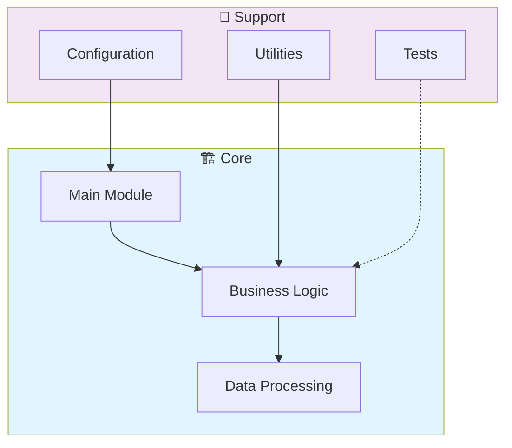

# 📊 Bash Data Ops Automation

> Professional data project by Gabriel Demetrios Lafis


[English](#english) | [Português](#português)

---

## English

### 🎯 Overview

**Bash Data Ops Automation** is a production-grade Shell application that showcases modern software engineering practices including clean architecture, comprehensive testing, containerized deployment, and CI/CD readiness.

The codebase comprises **1,118 lines** of source code organized across **6 modules**, following industry best practices for maintainability, scalability, and code quality.

### ✨ Key Features

- **🔄 Data Pipeline**: Scalable ETL with parallel processing
- **✅ Data Validation**: Schema validation and quality checks
- **📊 Monitoring**: Pipeline health metrics and alerting
- **🔧 Configurability**: YAML/JSON-based pipeline configuration

### 🏗️ Architecture


```mermaid
graph TB
    subgraph Core["🏗️ Core"]
        A[Main Module]
        B[Business Logic]
        C[Data Processing]
    end
    
    subgraph Support["🔧 Support"]
        D[Configuration]
        E[Utilities]
        F[Tests]
    end
    
    A --> B --> C
    D --> A
    E --> B
    F -.-> B
    
    style Core fill:#e1f5fe
    style Support fill:#f3e5f5
```

### 🚀 Quick Start

#### Prerequisites

#### Installation

```bash
git clone https://github.com/galafis/bash-data-ops-automation.git
cd bash-data-ops-automation
```

### 🧪 Testing

Run the test suite to verify everything works correctly.

### 📁 Project Structure

```
bash-data-ops-automation/
├── analysis/
│   ├── log_levels_summary.txt
│   ├── response_times_summary.txt
│   ├── services_summary.txt
│   └── time_patterns_summary.txt
├── diagrams/
│   └── ARCHITECTURE.md
├── images/
├── logs/
├── src/          # Source code
│   ├── data_pipeline.sh
│   └── log_analyzer.sh
├── test_pipeline_run/
│   ├── config/        # Configuration
│   ├── data/
│   │   └── raw/
│   └── logs/
├── tests/         # Test suite
│   ├── run_all_tests.sh
│   ├── test_data_pipeline.sh
│   └── test_log_analyzer.sh
├── AUDIT_REPORT.md
├── CONTRIBUTING.md
├── LICENSE
├── README.md
└── demo.sh
```

### 🛠️ Tech Stack

| Technology | Description | Role |
|------------|-------------|------|
| **Shell** | Core Language | Primary |

### 🤝 Contributing

Contributions are welcome! Please feel free to submit a Pull Request. For major changes, please open an issue first to discuss what you would like to change.

1. Fork the project
2. Create your feature branch (`git checkout -b feature/AmazingFeature`)
3. Commit your changes (`git commit -m 'Add some AmazingFeature'`)
4. Push to the branch (`git push origin feature/AmazingFeature`)
5. Open a Pull Request

### 📄 License

This project is licensed under the MIT License - see the [LICENSE](LICENSE) file for details.

### 👤 Author

**Gabriel Demetrios Lafis**
- GitHub: [@galafis](https://github.com/galafis)
- LinkedIn: [Gabriel Demetrios Lafis](https://linkedin.com/in/gabriel-demetrios-lafis)

---

## Português

### 🎯 Visão Geral

**Bash Data Ops Automation** é uma aplicação Shell de nível profissional que demonstra práticas modernas de engenharia de software, incluindo arquitetura limpa, testes abrangentes, implantação containerizada e prontidão para CI/CD.

A base de código compreende **1,118 linhas** de código-fonte organizadas em **6 módulos**, seguindo as melhores práticas do setor para manutenibilidade, escalabilidade e qualidade de código.

### ✨ Funcionalidades Principais

- **🔄 Data Pipeline**: Scalable ETL with parallel processing
- **✅ Data Validation**: Schema validation and quality checks
- **📊 Monitoring**: Pipeline health metrics and alerting
- **🔧 Configurability**: YAML/JSON-based pipeline configuration

### 🏗️ Arquitetura


```mermaid
graph TB
    subgraph Core["🏗️ Core"]
        A[Main Module]
        B[Business Logic]
        C[Data Processing]
    end
    
    subgraph Support["🔧 Support"]
        D[Configuration]
        E[Utilities]
        F[Tests]
    end
    
    A --> B --> C
    D --> A
    E --> B
    F -.-> B
    
    style Core fill:#e1f5fe
    style Support fill:#f3e5f5
```

### 🚀 Início Rápido

#### Prerequisites

#### Installation

```bash
git clone https://github.com/galafis/bash-data-ops-automation.git
cd bash-data-ops-automation
```

### 🧪 Testing

Run the test suite to verify everything works correctly.

### 📁 Estrutura do Projeto

```
bash-data-ops-automation/
├── analysis/
│   ├── log_levels_summary.txt
│   ├── response_times_summary.txt
│   ├── services_summary.txt
│   └── time_patterns_summary.txt
├── diagrams/
│   └── ARCHITECTURE.md
├── images/
├── logs/
├── src/          # Source code
│   ├── data_pipeline.sh
│   └── log_analyzer.sh
├── test_pipeline_run/
│   ├── config/        # Configuration
│   ├── data/
│   │   └── raw/
│   └── logs/
├── tests/         # Test suite
│   ├── run_all_tests.sh
│   ├── test_data_pipeline.sh
│   └── test_log_analyzer.sh
├── AUDIT_REPORT.md
├── CONTRIBUTING.md
├── LICENSE
├── README.md
└── demo.sh
```

### 🛠️ Stack Tecnológica

| Tecnologia | Descrição | Papel |
|------------|-----------|-------|
| **Shell** | Core Language | Primary |

### 🤝 Contribuindo

Contribuições são bem-vindas! Sinta-se à vontade para enviar um Pull Request.

### 📄 Licença

Este projeto está licenciado sob a Licença MIT - veja o arquivo [LICENSE](LICENSE) para detalhes.

### 👤 Autor

**Gabriel Demetrios Lafis**
- GitHub: [@galafis](https://github.com/galafis)
- LinkedIn: [Gabriel Demetrios Lafis](https://linkedin.com/in/gabriel-demetrios-lafis)
