```mermaid
graph TB
    subgraph "Data Pipeline (data_pipeline.sh)"
        A1[Start Pipeline] --> B1[Load Configuration]
        B1 --> C1[Extract Data]
        C1 --> D1[Validate Data]
        D1 --> E1{Valid?}
        E1 -->|Yes| F1[Transform & Enrich]
        E1 -->|No| G1[Move to Error Dir]
        F1 --> H1[Aggregate by Category & Date]
        H1 --> I1[Load to Processed Dir]
        I1 --> J1[Send Success Notification]
        G1 --> K1[Send Error Notification]
    end
    
    subgraph "Log Analyzer (log_analyzer.sh)"
        A2[Start Analysis] --> B2[Generate/Load Logs]
        B2 --> C2[Analyze Log Levels]
        C2 --> D2[Analyze Services]
        D2 --> E2[Analyze Response Times]
        E2 --> F2[Detect Time Patterns]
        F2 --> G2[Detect Anomalies]
        G2 --> H2[Generate Summary Report]
        H2 --> I2[Output to Analysis Dir]
    end
    
    style A1 fill:#90EE90,stroke:#333,stroke-width:2px
    style J1 fill:#90EE90,stroke:#333,stroke-width:2px
    style K1 fill:#FFB6C1,stroke:#333,stroke-width:2px
    style A2 fill:#87CEEB,stroke:#333,stroke-width:2px
    style I2 fill:#87CEEB,stroke:#333,stroke-width:2px
```

## Pipeline de Dados - Fluxo Detalhado

### Etapa 1: Extração
- Simula extração de dados de fontes externas
- Gera arquivo CSV com transações de vendas
- Inclui dados válidos e inválidos para teste

### Etapa 2: Validação
- Valida quantidade (número inteiro positivo)
- Valida preço (número positivo com decimais)
- Valida formato de data (YYYY-MM-DD)
- Valida campos obrigatórios
- Separa dados válidos dos inválidos

### Etapa 3: Transformação
- Enriquece dados com lookup de categorias de produtos
- Calcula valor total (quantidade × preço)
- Agrega vendas por data e categoria
- Calcula estatísticas (total de vendas, quantidade de itens, número de transações)

### Etapa 4: Carregamento
- Move dados transformados para diretório final
- Registra sucesso em logs
- Envia notificação (se habilitada)

## Análise de Logs - Funcionalidades

### Análises Disponíveis
1. **Níveis de Log**: Distribuição de INFO, WARNING, ERROR, DEBUG
2. **Serviços**: Top serviços com mais logs e erros
3. **Tempos de Resposta**: Estatísticas (média, mediana, min, max, desvio padrão)
4. **Padrões Temporais**: Distribuição de logs por hora
5. **Anomalias**: Detecção baseada em thresholds configuráveis
6. **Relatório Resumido**: Visão geral de todas as análises
